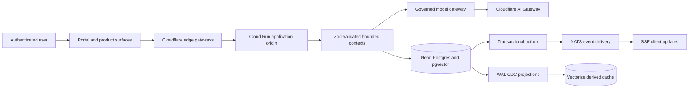

<!-- HEADY_BRAND:BEGIN
╔══════════════════════════════════════════════════════════════════╗
║  HEADY™ Latent OS — System Overview                             ║
║  LAYER: root · STATUS: canonical engineering entry point        ║
║  Made with ❤️ by HeadySystems Inc.                              ║
╚══════════════════════════════════════════════════════════════════╝
HEADY_BRAND:END -->

# Heady™ Latent OS

Heady is a governed AI operating system built as a Node.js ESM monorepo. The repository contains the
modular application backbone, browser surfaces, edge gateways, shared packages, governance controls,
and the tooling used to validate and project the system.

The product is **pre-launch**. Code, configuration, and deployment manifests in this checkout describe
the intended system, but they do not by themselves prove that a public route or cloud service is live.
Production claims require separate verification of the deployed revision, runtime configuration,
identity path, secrets, and an end-to-end request.

## System at a glance



The architecture follows four rules:

1. **Neon PostgreSQL is authoritative.** Durable state and retrieval authority live in Neon;
   pgvector uses 384-dimensional embeddings locked to `@cf/baai/bge-small-en-v1.5`.
2. **Cross-boundary writes are transactional.** A bounded context changes its state and appends its
   outbox record in the same transaction. NATS distributes events; it is not a second write authority.
3. **Edge data is derived.** Upstash Redis is a short-lived cache and Vectorize is reconstructible.
   Neither may become a source of truth.
4. **Identity and policy fail closed.** Firebase establishes user identity, servers derive tenant
   context, GCP Secret Manager supplies secrets, and privileged actions pass the approval policy.

## Indexing and projection triggers

Heady deliberately has two triggers for two different source types:

| Source | Trigger | Destination | Authority |
|---|---|---|---|
| Files and source content | Local Merkle-tree file hashing | Embedding pipeline and semantic index | The canonical file content |
| Database records | PostgreSQL WAL CDC | Derived stores and edge projections | Neon PostgreSQL |

PostgreSQL CDC must not be used to discover source-file changes, and file hashing must not replace the
database projection path.

## Repository map

| Path | Responsibility |
|---|---|
| `apps/` | Deployable applications and edge gateways |
| `packages/` | Reusable ESM bounded-context and infrastructure packages |
| `tooling/` | Build, governance, coherence, projection, and documentation tools |
| `configs/` | Validated registries and non-secret configuration |
| `governance/` | Enforced constitution, directives, and policy-to-enforcer mapping |
| `policies/` | OPA/Rego policy sources |
| `docs/adr/` | Canonical architecture decision records |
| `docs/` | System guides, runbooks, designs, plans, and historical evidence |
| `.agents/` | Agent workflows and repository-local skills |

The top-level `src/`, `scripts/`, and some older configuration trees contain migration-era capability.
Treat them as implementation evidence to validate, not as architectural authority. New work belongs in
the pnpm workspace unless an accepted ADR says otherwise.

## Main runtime surfaces

| Surface | Path | Runtime role |
|---|---|---|
| Heady Manager | `apps/heady-manager` | Express/Cloud Run origin composed through the latent-service kernel |
| HeadyMe Portal | `apps/headyme-portal` | Vite PWA and authenticated user/admin experience |
| Portal Gateway | `apps/heady-portal-gateway` | Cloudflare Worker bridging authenticated browser requests to private origins |
| Edge Gatekeeper | `apps/heady-edge-gatekeeper` | Cloudflare authorization boundary |
| Approval API | `apps/approval-api` | Governed approval control plane backed by Neon, OPA, Firebase/workload identity, and KMS receipts |

Package manifests and tests are the best evidence that a component exists locally. Deployment status
must be checked independently.

## Local setup

Requirements are Node.js 22, pnpm 9.15.9, and access to the repository's approved secret-resolution
path when a command needs cloud services.

```bash
pnpm install --frozen-lockfile
pnpm run facts:validate
pnpm run build
pnpm run test
```

Useful focused commands:

```bash
pnpm --filter heady-manager test -- --test-concurrency=1
pnpm --filter @heady/db test
pnpm --filter @heady/approvals test
pnpm --filter @heady/approval-api test
pnpm run consistency:verify
```

Do not place credentials in source or committed environment files. Runtime secrets resolve through
HeadyVault and GCP Secret Manager.

## How to change the system safely

1. Read [`AGENTS.md`](AGENTS.md) and the relevant rules in [`governance/`](governance/README.md).
2. Confirm the current authority in [`facts.yaml`](facts.yaml), then read the applicable
   [architecture decisions](docs/adr/README.md).
3. Check the working tree before editing and preserve unrelated changes.
4. Add Zod validation at service boundaries, structured Pino logging, error handling, and tests.
5. Run focused tests first, then the coherence and governance gates appropriate to the change.
6. Verify deployed state separately before describing a change as live.

Patent-locked files marked `⚠️ PATENT LOCK` require ARBITER review. Approval-genesis operations also
require an independent, signed ALLOW/DENY artifact bound to the exact commit and bundle digest; passing
automated tests is not a substitute.

## Documentation

Start with the [documentation map](docs/README.md). It identifies which documents are binding,
implementation-oriented, explanatory, planned, or historical. The most important references are:

- [Source-of-truth declaration](SOURCE_OF_TRUTH.md)
- [Architecture decisions](docs/adr/README.md)
- [System compendium](docs/compendium/00-INDEX.md)
- [Package catalog](docs/PACKAGE_CATALOG.md)
- [Environment separation](docs/ENV_SEPARATION.md)
- [Governance model](governance/README.md)

When prose conflicts with a validated machine-readable source or an accepted ADR, the latter wins.

---

*∞ Sacred Geometry · Liquid Intelligence · Permanent Life ∞*
*Made with ❤️ by HeadySystems Inc.*
