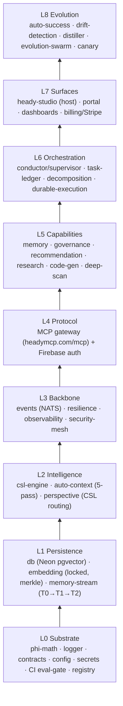

<!-- HEADY_BRAND:BEGIN -->
<!-- HEADY™ Build Plan · Sacred Geometry · © 2026 HeadySystems Inc. — Eric Haywood -->
<!-- HEADY_BRAND:END -->
# Heady — Build Plan (from scratch)

> The throughline: get the L0–L4 spine **deterministic and fail-closed**, ship the thinnest
> `auth → gateway → memory → studio` slice that actually runs, then every new capability is
> **one MCP server + one registry row** — never a rewrite.

Heady is an **MCP host over a mesh of MCP servers**, on a deterministic φ-math substrate. That
topology dictates the build order: build a *walking skeleton* (thin vertical slice) first, then widen.

## Non-negotiable constraints (decided once, enforced from commit #1)

| Constraint | Why it can't be retrofitted |
|------------|------------------------------|
| **Determinism** — same input + configs ⇒ same plan graph (seeded, replayable) | Replay/audit is structural, not a feature |
| **φ-math, zero magic numbers** — all timeouts/pools/thresholds from `@heady/phi-math` | Tuning later means touching everything |
| **Fail-closed** — no creds ⇒ no work; no auth ⇒ 401; no infra ⇒ honest `bound:false` | Security and "no fabricated data" are invariants |
| **Single source of truth** — one registry/manifest the whole system renders from | Drift is the #1 long-term killer |
| **MCP-uniform** — every capability is an MCP server | "Heady feature" == "external server" == one toggle |

## Dependency layers (bottom-up — what's buildable when)

You cannot meaningfully build L4 without L0–L2; everything above L4 is "add a server."

## Beachheads (what to ship, in order, each lands something real)

| # | Beachhead | Components built in | Definition of Done |
|---|-----------|---------------------|--------------------|
| **0** | Substrate | Turborepo+pnpm, `phi-math`, `logger`, `contracts`, `secrets`, CI eval-gate | `pnpm turbo build test` green; secrets resolve from Vault/OIDC; gate blocks a `localhost`/`TODO`/`require()` commit |
| **1** | Memory | `db`, `embedding` (bge-small-en/384, merkle-triggered), `memory-stream`, `auto-context` | Store a memory, retrieve it semantically end-to-end through pgvector, behind the gate-then-embed precondition |
| **2** | Protocol (the spine) | MCP gateway + Firebase auth + **one** real tool (`heady_memory_search`) | Authed MCP client completes a round-trip; unauth ⇒ 401 — this is the walking skeleton |
| **3** | Intelligence | `csl-engine` (geometric gates — core IP), `perspective`, `governance` + `recommendation` servers | Requests route by cosine; policy gates fail-closed; suggestions fire |
| **4** | App | `heady-studio` host UI rendering from the manifest | Login → connect → call tools → see results |
| **5** | Orchestration | `events` (NATS), `conductor`/`supervisor`, durable execution (CF Workflows/Queues), `task-ledger` | A multi-agent task decomposes, fans out, replays deterministically |
| **6** | Monetization | Billing meter + feature toggles → Stripe | Toggling a feature provably changes the per-message meter and the invoice |
| **7** | Evolution | Auto-success heartbeat, drift detection, distiller, canary (1→5→20→100%) | The system proposes and canaries its own improvements |

> **This PR** (`heady-studio` + `heady-mcp-gateway` + `studio-registry`) is Beachheads **2 + 4 + the
> meter half of 6**, deliberately stubbed thin so the skeleton breathes before the depth lands.

## Cross-cutting components (present from Phase 0 — never bolted on)

- **The registry/manifest** — single source of truth; every option is a data row.
- **Observability** — structured logs + traces on the very first endpoint.
- **Secrets resolver** — no `.env` plaintext, ever.
- **CI eval-gate** — the "OS of the OS"; gates every merge.
- **Determinism harness** — seeded RNG + replay log in the pipeline runner.
- **Fail-closed defaults** — auth, governance, infra-unbound paths.
- **Checkpoint protocol** — drift/doc/registry sync at each phase boundary.

## Branch strategy

`main` (protected, archive) ← `rebuild`/`staging` (active integration) ← short-lived
`claude/<slice>` feature branches, one per beachhead slice, each green through the eval-gate
before merge.
