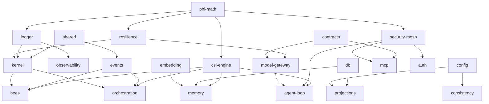

<!-- HEADY_BRAND:BEGIN
╔══════════════════════════════════════════════════════════════════╗
║  HEADY™ Rebuild Package Catalog                                   ║
║  Made with ❤️ by HeadySystems Inc.                                ║
╚══════════════════════════════════════════════════════════════════╝
HEADY_BRAND:END -->

# Rebuild Package Catalog

> **Status:** For founder approval · **Date:** 2026-06-16 · **Owner:** Eric Anthony Haywood
> **Derives from:** `docs/LEGACY_STACK_COMPONENT_DISPOSITION.md` (the 8-layer audit) + locked decisions (`SOURCE_OF_TRUTH.md`, ADRs).

The definitive set of `packages/*` libraries the rebuild should contain, each justified by the legacy components it absorbs (cited by audit ID, e.g. `BE-08`). Apps, Workers, and tooling are listed separately — they are deployables/CLIs, not shared libraries.

**Design constraints (locked):** dependency-minimalism (ADR-0019/R1) — consolidate, don't fragment; ESM-only Node22; every package pure/testable where possible (the `packages/embedding` pattern); φ-constants from `@heady/phi-math`; one monorepo (CI rejects new top-level dirs without an ADR).

**Legend:** ✅ scaffolded & tested · 🔲 to scaffold · ⏸ defer (Phase 4+) · ⚠️ patent zone (ARBITER review).

**Status today:** 14 of ~24 packages exist (✅ — Tier 0 + Tier 1). 10 remain (🔲/⏸ — Tiers 2–4).

---

## Tier 0 — Foundation (✅ all scaffolded)

The math/contract/data/security base everything else imports.

| Package | Purpose | Absorbs (legacy → audit) | Depends on | Status |
|---|---|---|---|---|
| `@heady/phi-math` | Golden-ratio constants, Fibonacci, φ-backoff, gate thresholds | `maximum-potential/phi-constants` (AG-04), `sacred-geometry.js` (DA-16) | — | ✅ |
| `@heady/csl-engine` ⚠️ | Continuous Semantic Logic geometric gates + ternary `cslGate` | `shared/csl-engine-v2` (BE-04), `heady-vsa-integration` (BZ-05) | phi-math | ✅ |
| `@heady/contracts` | OpenAPI 3.1 surface → types/Zod/`mcp-tools.json` | `proto/` (MC-20), API specs | — | ✅ |
| `@heady/logger` | Pino-shaped JSON, trace-id, redaction, φ-sampling | `monitoring`/`observability` logger (IN-16) | phi-math | ✅ |
| `@heady/db` | Neon+pgvector SoR, transactional outbox, idempotency, `vector(384)` | `migrations/0001-0009` (DA-01); supersedes `db/` 1536 (DA-02) | — | ✅ |
| `@heady/security-mesh` ⚠️ | Fail-closed authz (SEC-002), HMAC signing, RBAC, CSP, injection scan | `security/` 18 modules (IN-17), `heady-mcp-security` (MC-08) | phi-math | ✅ |
| `@heady/embedding` | Content-addressed embed pipeline, instantaneous acquisition (ADR-0024) | `memory/embedding-pipeline` core dropped, breaker kept (DA-07) | — | ✅ |
| `@heady/secrets` | GCP Secret Manager loader, fail-closed, rotation | `credential-rotation` (IN-18), `heady-connector-vault` (MC-20) | — | ✅ |

---

## Tier 1 — Core runtime (✅ all scaffolded & tested)

The service skeleton: config, shared types, resilience, the event bus, observability, and the microkernel lifecycle. (Scaffolded 2026-06-16; 33 tests passing.)

| Package | Purpose | Absorbs (legacy → audit) | Depends on | Status |
|---|---|---|---|---|
| `@heady/config` | `facts.yaml` golden-record loader + validation + fail-closed env access | `facts.yaml` (DX-01, **created at repo root**), `config/`+`configs/` (DX-13) | shared | ✅ |
| `@heady/shared` | Typed errors, `Result<T,E>`, health/metrics shapes, Latent Service Pattern contract | `shared-ts` (BE-08, port-as-is), `shared/` (BE-07), `utils/` (DX-12) | — | ✅ |
| `@heady/resilience` | Circuit breaker, bulkhead, graceful shutdown, φ-backoff retry/timeout | `circuit-breaker` (BE-10), `middleware` bulkhead (BE-16), `scaling` libs (IN-12) | phi-math, shared | ✅ |
| `@heady/events` | Typed action/observation bus, `agent.*`/`heady.observation.*` subjects + wildcard routing, outbox projector | `nats` (IN-11), `heady-event-bus`, `heady-a2a-protocol` (AG-17), `OutboxProjector` | shared | ✅ |
| `@heady/observability` | Vendor-neutral metrics + spans; OpenTelemetry + Sentry + Langfuse exporters wire on top | `observability`/`otel-wrappers` (IN-16); Sentry/Langfuse are **net-new** | logger | ✅ |
| `@heady/kernel` | Latent Service Pattern `{start,stop,health,metrics}`, dependency-ordered boot, aggregate health/metrics | `core/heady-manager-kernel` (BE-02), `boot` (IN-15), runtime-bundle kernel (BZ-04) | shared, logger, resilience | ✅ |

---

## Tier 2 — Data & model (🔲 Phase 2)

| Package | Purpose | Absorbs (legacy → audit) | Depends on | Status |
|---|---|---|---|---|
| `@heady/memory` | 3-tier memory (T0 KV → T1 pgvector authority → T2 Vectorize derived cache), hybrid + graph retrieval | `memory/vector-store` (DA-06), `heady-hybrid-vector-search`, `heady-graph-rag-memory`; folds in legacy `packages/vector` target (BZ-07) | db, embedding, csl-engine | 🔲 |
| `@heady/projections` | Generated-not-authored projection engine: `projection.yaml` manifest, content-addressed SHA-256, drift states | `heady-projection` (DA-11), `projections`/`sacred-projections` (DA-12), `projection-engine` (DA-08) | db, config | 🔲 |
| `@heady/model-gateway` | CF AI Gateway single egress chokepoint; model mesh routing; Liquid edge tier; fallback chain | `liquid-nodes` (MC-04, **reroute the gateway bypass R-3**), `heady-gateway-routing`, `heady-embedding-router` | contracts, resilience | 🔲 |
| `@heady/auth` | Firebase Auth + cross-domain SSO + RBAC (pairs with security-mesh) | `auth/` (BE-12), `auth-service` RBAC/API-keys (BE-13), `heady-firebase-auth-orchestrator` | security-mesh | 🔲 |

---

## Tier 3 — Agents & MCP (🔲 Phase 2–3)

| Package | Purpose | Absorbs (legacy → audit) | Depends on | Status |
|---|---|---|---|---|
| `@heady/bees` ⚠️ | `BaseHeadyBee` lifecycle, bee factory, swarm coordinator/federation (the 197-bee / 24-domain taxonomy) | `agents/` φ-swarm engine (AG-01), `maximum-potential/liquid-nodes` BaseBee (AG-03), `heady-bee-swarm-ops` (AG-17) | csl-engine, events, kernel | 🔲 |
| `@heady/agent-loop` | Vercel AI SDK v6 harness; rustc stage0/1/2 bootstrap; eval/fidelity gate; personas/directives (cognition) | `heady-agents` personas not SDK (AG-13), `maximum-potential` prompt (AG-05), `heady-cognition`/`personas`/`directives` (AG-07/09/10) | model-gateway, security-mesh, csl-engine | 🔲 |
| `@heady/orchestration` | Durable flows on CF Workflows + Queues + DO; the Auto-Flow `runFlow` engine; pipeline/conductor | `orchestration` custom-LangGraph→CF Workflows (BE-11), `heady-10-10` LAW-07 (AG-05), `tooling/auto-flow` engine | events, kernel, csl-engine | 🔲 |
| `@heady/mcp` | MCP server + runtime tool registry (`mcp-tools.json`), stdio/HTTP transports | `mcp-servers` v6 + tool services (MC-01/03/06), `heady-mcp-gateway` | contracts, security-mesh | 🔲 |

---

## Tier 4 — Governance & verticals (⏸ Phase 3–4)

| Package | Purpose | Absorbs (legacy → audit) | Depends on | Status |
|---|---|---|---|---|
| `@heady/consistency` | Graduate `tooling/data-consistency` into a package; MAPE-K consistency engine over `facts.yaml` | the consistency gate (built), `tooling/cce/check-facts` (DX-12) | config | 🔲 |
| `@heady/approvals` | HCP records, OPA/Rego policy, φ-canary gates, Ed25519 receipts | `branch-protection` (IN-05), `policy` OPA (IN-06), playbook §6 | db, security-mesh, contracts | ⏸ |
| `@heady/compliance` | GDPR/HIPAA/SOC2 middleware + audit templates | `compliance-templates` (BZ-13, IN-18) | security-mesh, db | ⏸ |
| `@heady/connectors` | Connector forge + health (89+ integrations, dynamic MCP adapters) | `integrations`, `heady-connector-forge`, `heady-connector-health` | mcp, secrets | ⏸ |

---

## Dependency graph (target)

---

## What is NOT a package (boundary)

Deployables and CLIs live outside `packages/`:

- **`apps/`** (deployed surfaces): `headyme-portal` ✅ (MCP Console / admin — the spearhead, FE-01/02), `heady-manager` (Cloud Run origin, BE-01→kernel), `marketing` (CF Pages from `content/`+`assets/`, FE-09/11/12), `assistant-ui` ⏸ (FE-03).
- **`workers/`** (Cloudflare edge): `edge-router`, `liquid-gateway`, `secret-service`, `mcp-edge` (IN-13/14) — thin Hono entrypoints that compose the packages above.
- **`tooling/`** (build/ops CLIs, not shipped): `data-consistency` ✅, `skill-registry` ✅, `auto-flow` ✅ (preflight), `projector` 🔲 (Copybara-driven projection CLI, BZ-08/playbook §3).

---

## Consolidation & naming decisions

- **Folded in (no separate package):** `cognition`/personas/directives → `@heady/agent-loop` + `@heady/config`; legacy `packages/vector` & `packages/engines` targets → `@heady/memory` and `@heady/orchestration`/`@heady/bees`; `middleware` → split across `@heady/resilience` + `@heady/security-mesh`.
- **Deferred (real value, Phase 4+ / gated):** `compliance`, `connectors`; verticals (`heady-enterprise` BZ-10, fintech/nonprofit/analytics) ship as **apps**, not core packages, and only after the portal spearhead.
- **Dropped, not packaged:** Qdrant tier, self-hosted Postgres/pgbouncer/nginx, Render/Azure/PM2, the 290-dir `services/` sprawl, all meta-rebuild snapshots (BZ-17) — superseded by this monorepo.
- **Patent zones** (`⚠️`): `csl-engine`, `security-mesh`, `bees` carry patent-locked logic (HS-2026-051+) and require ARBITER review before modification.

## Recommended scaffold order

1. **Phase 1 (✅ done):** `config`, `shared`, `resilience`, `events`, `observability`, `kernel` — the runtime skeleton (Tier 1), scaffolded & tested.
2. **Phase 2 (next):** `memory`, `projections`, `model-gateway`, `auth`, then `bees`, `agent-loop`, `orchestration`, `mcp`.
3. **Phase 3–4:** `consistency` (graduate the tool), `approvals`, `compliance`, `connectors`.

Each new package: `package.json` (`@heady/<name>`, `type: module`, `node --test`), HEADY header, φ-constants from `@heady/phi-math`, tests alongside, and a row added to this catalog. New top-level dirs require an ADR (governance rule).
