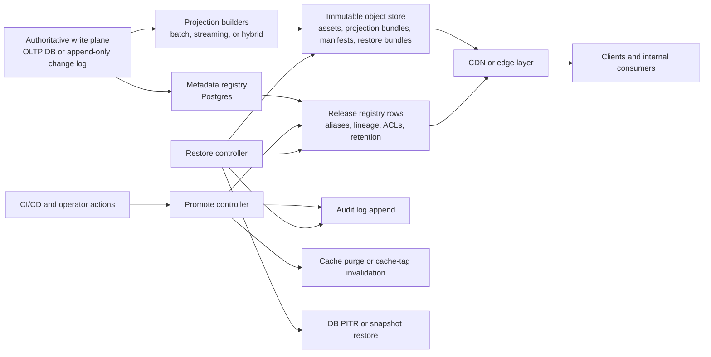
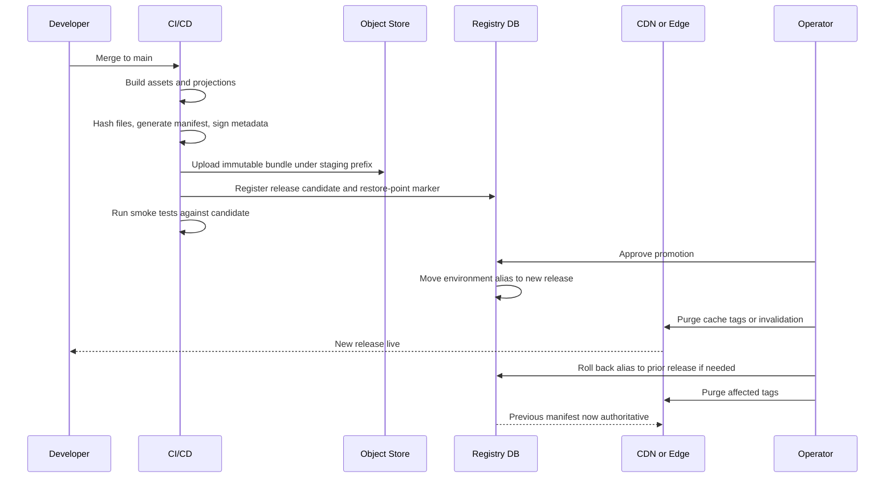
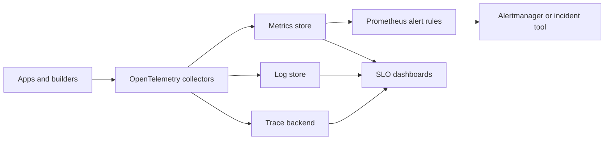
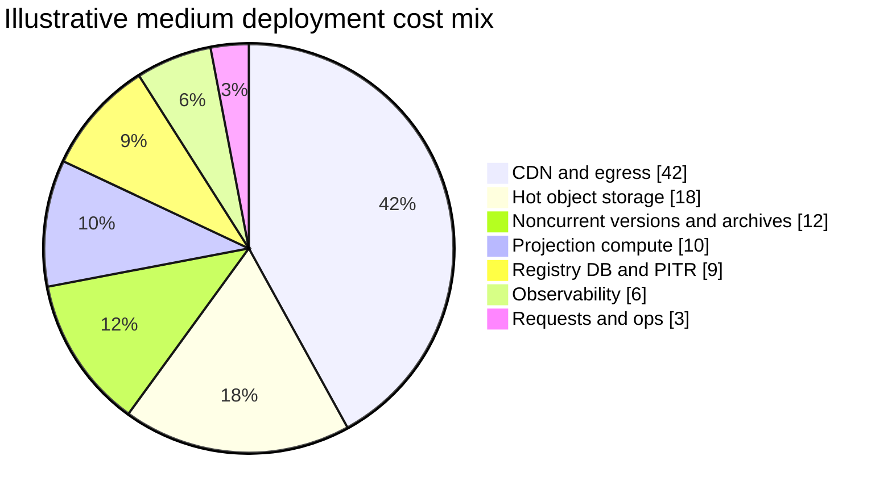

# Reference Architecture for Projections, Static Delivery, and Restore Points

## Executive summary

The strongest pattern visible across the reachable Heady repositories is not “serve files directly from Git,” but rather “coordinate delivery through manifests, registries, checkpoint protocols, operational APIs, and environment-specific promotion surfaces.” Publicly reachable repos already contain delivery manifests, Render blueprints, admin APIs, SSE log streaming, checkpoint scripts, registry endpoints, static frontend roots, and evidence/checkpoint directories. At the same time, the repos also show the downside of using Git repositories as long-lived binary and evidence stores: one synchronization report shows Git LFS objects exceeding a 2 GB remote limit with 5.5 GB total, which blocked a remote push. That is the clearest signal that production delivery artifacts, restore bundles, and evidence packets should move to immutable object storage with a metadata control plane, while Git remains the source-control and workflow layer.

The best overall design, assuming no cloud lock-in requirement, is a **selective CQRS** system: authoritative writes live in the transactional system of record, while projections are derived, disposable read models optimized independently for delivery and query patterns. Static bundles and projection outputs should be published as immutable, content-addressed objects into an object store, then exposed through a CDN or edge layer. Promotion should mutate only a small manifest pointer or registry row, never the underlying objects. Restore should prefer **pointer rollback first**, **projection rebuild second**, and **authoritative DB point-in-time recovery only for source-of-truth incidents**. This preserves clarity, reduces blast radius, and keeps recovery fast. Microsoft’s CQRS guidance explicitly supports separate read and write models, while its event-sourcing guidance warns that full event sourcing imposes major complexity and migration cost; PostgreSQL materialized views further reinforce the idea that read models can be persisted and refreshed without becoming the source of truth.

The recommended default storage split is straightforward. **Object storage** should hold static assets, projection bundles, manifests, restore bundles, audit exports, and evidence packets; cloud vendors explicitly position object storage for browser delivery, distributed access, streaming, backup/restore, and archive use cases. **Block storage** should be reserved for VM-attached mutable state that genuinely needs disk semantics. **Shared file storage** should be used only when POSIX/SMB/NFS semantics or shared mounts are essential. **Databases** should store registry metadata, lineage, access-control state, and small operational state, not large immutable binaries. That split fits both the official cloud-product boundaries and the operational signals already present in the Heady repos.

For delivery, the highest-confidence pattern is: CDN/edge in front of private or semi-private object storage, signed access for protected content, conditional requests with ETags, range requests for large artifacts, and limited edge compute for authorization, manifest resolution, and cache-aware routing. CloudFront, Cloud CDN, and Azure Front Door all support protected content and edge caching; Cloudflare’s stack additionally makes it easy to combine Worker logic with globally cached static assets, and R2 provides S3-compatible object storage with no egress fees to the Internet. Signed URLs and signed cookies are especially useful for bulk or time-limited access patterns, though Google explicitly notes signed URLs are most useful when object bytes themselves move between the requester and object store.

The most important operational rule is this: **make every release immutable, every promotion reversible, and every restore observable**. That means bucket versioning or equivalent, WORM/retention lock for compliance-sensitive restore bundles, PITR for the metadata database, append-only audit logs, regular restore drills, and GitHub Actions environments with required reviewers for production promotion. AWS S3 Object Lock, Google Cloud Bucket Lock, and Azure immutable blob storage all provide provider-native immutability controls; managed database PITR is also first-class across AWS, GCP, and Azure. GitHub additionally supports artifact retention controls and production-environment approvals, which makes it suitable for CI/CD orchestration but not for long-term artifact retention.

## What the current Heady repositories already suggest

The public repo audit shows a surprisingly coherent direction. The common themes are **checkpointing, registries, static serving, delivery manifests, environment separation, operational health/status endpoints, and AI-assisted administration**. What is missing is a single formalized artifact protocol that distinguishes source-of-truth data from derived projections and from restore bundles.

| Repository | Status | Audit finding | Architectural implication |
|---|---|---|---|
| `HeadySystems/main` | Public archive | Root contains `DELIVERY_MANIFEST.md`, install/demo ZIPs, `dump.md`, and `render.yaml`; the Render blueprint defines a Python worker with a persistent disk and a managed Postgres database. | Delivery manifests already exist, but binary outputs are still repo-centric. Move release binaries out of Git and keep only manifests plus provenance in Git. |
| `HeadySystems/HeadyMe` | Not publicly reachable | Returned 404 during inspection. | Treat as unresolved in this report. |
| `HeadySystems/HeadyMonorepo` | Not publicly reachable | Returned 404 during inspection. | Treat as unresolved in this report. |
| `HeadySystems/Heady-Main` | Public | README describes Node/Express static file serving, Admin IDE, Render deployment, protected admin APIs, SHA-256 conflict detection on writes, and SSE operation log streams. | Strong basis for a control plane: manifests, admin APIs, operation streams, and integrity checks already fit a formal release protocol. |
| `HeadySystems/heady-ai` | Public | Repo includes `public/` static frontend, Cloudflare worker scaffolds, CI pipelines, evidence folders, a central `heady-registry.json`, and a documented checkpoint protocol with `checkpoint-sync.ps1`. | This is the clearest signal that registry-driven discoverability and checkpoint-based projection release management should be first-class. |
| `HeadySystems/Heady` | Public archive | Large monorepo with `distribution`, `public`, `nginx`, `workers`, `workflows`, `evidence`, and `deployment*` files; README calls out checkpoint sync and a central registry; sync report shows evidence packets, WORM-ready posture, and Git LFS size failures blocking remote sync. | Do not keep evidence packets and release bundles in Git/Git LFS as the primary artifact plane. Use immutable object storage and keep Git for manifests, code, ADRs, and workflow logic. |
| `HeadySystems/Projects` | Not publicly reachable | Returned 404 during inspection. | Treat as unresolved in this report. |
| `HeadySystems/sandbox` | Public | Experimental repo includes `assets/brand`, `distribution`, `ci-pipelines`, `evidence`, and scaffolds for Cloud Run services, Cloudflare workers, pgvector migrations, Docker, smoke tests, and runbooks. | Good staging ground for testing the target protocol before promoting into core repos. |
| `HeadySystems/CascadeProjects` | Not publicly reachable | Returned 404 during inspection. | Treat as unresolved in this report. |
| `HeadySystems/HeadyEcosystem` | Public | Monorepo with apps/services/scripts/docs, Drupal JSON:API sync, Docker Compose, GitHub Actions CI/CD, staged deployment commands, production approval, centralized logging, uptime monitoring, and Sentry. | A mature multi-app repo that already implies promotion gates and operational observability; ideal for adopting a formal publish/promote/rollback lifecycle. |
| `HeadySystems/Heady-Staging` | Public | Public/docs/status pages, checkpoint automation scripts, ORS-gated five-stage pipeline, registry endpoints, and structured data directories for raw/processed/external data and notebooks. | Environment promotion is already conceptualized; make it manifest-driven instead of repo-clone-driven. |
| `HeadySystems/Heady-Testing` | Public | Mirrors staging patterns: docs/status pages, checkpoint automation, ORS-gated pipeline, registry APIs, and data/notebook structure. | Use testing as the mandatory restore-drill and projection-rebuild environment. |
| `HeadySystems/heady-ai-sandbox` | Not publicly reachable | Returned 404 during inspection. | Treat as unresolved in this report. |
| `HeadySystems/HeadyAutoContext` | Public | Defines small/medium/large context tiers, a `GET /api/context/:tier` gateway API, scheduled sync (`context-sync-bee`), and emits sync metadata like file count and last-sync timestamp. | This is a strong precedent for serving **packaged projections by tier** rather than raw unbounded dumps. |
| `HeadySystems/heady-automation-ide` | Not publicly reachable | Returned 404 during inspection. | Treat as unresolved in this report. |
| `HeadySystems/ai-workflow-engine` | Public archive | Cloudflare Worker-based workflow engine with Redis cache, Render PostgreSQL, GitHub Gist-backed config, KV namespace, enabled observability, and health/workflow endpoints. | Strong edge-control-plane precedent. Use this pattern for manifest lookup, download authorization, and projection orchestration—not for long-term file retention. |
| `HeadySystems/Heady-pre-production` | Public archive | Pre-production repo includes checkpoint scripts, project-state files, Render config, deploy logs, and static-serving/admin patterns. | Good evidence that restore-point and project-state concepts already exist; formalize them into immutable restore bundles plus DB markers. |
| `HeadySystems/sandbox-pre-production` | Public | Explicitly described as “Area for Project Checkpoints and File Dumps”; includes `audit_logs.jsonl`, `hc-checkpoint.bat`, `render.yaml`, static serving, admin APIs, rate limiting, allowlisted file roots, SHA-256 conflict detection, and Cloudflare/MCP references. | This repo is the clearest internal precursor to a restore-point control plane. The protocol should preserve the concept but move the bulk data to object storage. |

Three conclusions follow directly from that audit. First, Heady already has a **registry mindset** and a **checkpoint mindset**; the missing step is to make those ideas authoritative outside the Git repo. Second, Heady already uses **multi-environment clones and automated status/report surfaces**, which means manifest promotion and rollback can fit naturally into current workflows. Third, the repos provide direct evidence that Git-hosted binaries and evidence packets do not scale cleanly as a delivery substrate, particularly when LFS size becomes a synchronization bottleneck.

## Recommended architecture and workflow

The simplest explainable model is this:

**authoritative source → derived projection build → immutable object publish → mutable manifest promotion → CDN/edge delivery → restore by manifest rollback or rebuild.**

That model is easier to reason about than full event sourcing, aligns with CQRS guidance, and matches PostgreSQL-style materialized read models. Use full event sourcing only where replayability and audit history are business-critical enough to justify the extra complexity; otherwise, keep authoritative writes in transactional storage and make projections explicitly rebuildable.



The recommended default component split is:

| Layer | Recommended default | Why |
|---|---|---|
| Authoritative writes | Managed transactional DB plus append-only change log | Keeps business truth simple and makes projections disposable. Supported by CQRS guidance and managed PITR across clouds. |
| Projection outputs | Object storage, optionally plus materialized views/search indexes | Object stores are purpose-built for browser delivery, distributed access, streaming, backup/restore, and archive. |
| Static assets | Object storage or tightly integrated worker static assets | This is the cleanest path to immutable, cacheable release bundles. Cloudflare specifically supports single-operation deploys of worker code plus static assets. |
| Metadata, lineage, discoverability | Postgres registry | Heady already uses registry concepts; Postgres is ideal for manifests, aliases, ACLs, retention state, and search metadata. |
| Hot caching | CDN/edge + optional Redis for control-plane lookups | Edge reduces latency and origin load; Redis is useful only for ephemeral control-path acceleration, not artifact truth. |
| Restore plane | Immutable restore-bundle bucket + DB PITR | Fast for pointer rollbacks, safer for destructive incidents, better auditability. |

The key design invariants should be explicit:

- **Objects are immutable**. A content change produces a new object key.
- **Aliases are mutable**. `current`, `stable`, and environment aliases can move.
- **Projections are disposable**. They are never the ultimate source of truth.
- **Restore points are composite**. A restore point is not just “a DB backup” or “a ZIP”; it is a manifest over object versions, schema version, config version, and a DB recovery marker.
- **Operator actions are append-only**. Promotions, rollbacks, restores, purges, and retention overrides all emit audit events.
- **Git stores intent and workflow**, not long-lived binaries.

A practical release lifecycle looks like this:



For projections specifically, I recommend three classes because it keeps the workflow understandable:

| Projection class | Examples | Delivery rule | Restore rule |
|---|---|---|---|
| **Inline hot projections** | small JSON docs, API-side denormalized views, user-visible status summaries | Serve via API or CDN with ETag caching | Rebuild quickly from source log or OLTP tables |
| **Bundle projections** | Parquet exports, search snapshots, image/video derivatives, report bundles, context packs | Publish as immutable objects via signed URLs or CDN | Restore by pointer rollback; rebuild asynchronously if corrupted |
| **Cold evidence bundles** | evidence packets, compliance exports, patent/demo archives, checkpoint dumps | Keep off the hot path; expose only via signed, audited access | Protect with retention lock / WORM and long retention |

That division is consistent with the repo evidence: `HeadyAutoContext` already uses tiered packaged context; `Heady` and `sandbox-pre-production` already generate evidence/checkpoint surfaces; and the staging/testing repos already separate documentation, registry, and pipeline state.

## Protocol specifications and APIs

The protocol should be **REST over HTTPS** with **JWT/OIDC for machine actors**, **short-lived signed download grants for data-plane access**, **ETag-based optimistic concurrency for manifest updates**, **Range support for large file download**, and **RFC 9457 Problem Details** for errors. HTTP semantics already define the relevant behavior for range requests and conditional requests, and RFC 9457 standardizes error envelopes cleanly.

A canonical object-key scheme should be stable and human-inspectable:

```text
assets/{app}/{env}/{release_id}/{relative_path}
projections/{projection_name}/{schema_version}/{release_id}/{shard_or_partition}/{filename}
manifests/{env}/{alias}.json
restore-points/{env}/{restore_point_id}/manifest.json
restore-points/{env}/{restore_point_id}/db-marker.json
audit/{yyyy}/{mm}/{dd}/{event_id}.json
```

The actual object payloads should also carry metadata headers such as:

```text
Content-Type
Cache-Control
ETag
x-release-id
x-schema-version
x-content-sha256
x-lineage-source
x-retention-class
```

That split keeps the path queryable while making integrity and lineage machine-readable. Use content hashes as immutable object identity and release IDs as grouping identity; do not use mutable “latest” paths for the true bytes. The practical value of conditional requests and validators is directly supported by HTTP semantics.

The core API surface should be small:

| Method | Endpoint | Purpose | Auth |
|---|---|---|---|
| `POST` | `/v1/releases` | Register a candidate release manifest after upload | CI OIDC/JWT |
| `POST` | `/v1/releases/{releaseId}/validate` | Verify checksums, required files, metadata completeness | CI or operator |
| `POST` | `/v1/environments/{env}/promote` | Move an environment alias to a release | Protected operator or approved CI |
| `POST` | `/v1/environments/{env}/rollback` | Repoint alias to a prior release | Protected operator |
| `POST` | `/v1/restore-points` | Create composite restore point metadata | CI or scheduler |
| `GET` | `/v1/restore-points/{id}` | Inspect restore-point manifest and lineage | Operator/auditor |
| `POST` | `/v1/restores` | Execute restore workflow | Step-up auth |
| `POST` | `/v1/projections/{name}/rebuild` | Request rebuild for a projection class/partition | CI/operator |
| `GET` | `/v1/manifests/{env}/{alias}` | Resolve current manifest | Edge service or internal client |
| `POST` | `/v1/access-tokens` | Mint signed URLs/cookies for protected bundles | Authenticated app/backend |
| `POST` | `/v1/cache/purge` | Purge cache tags, keys, or paths after promotion/rollback | CI/operator |

A representative release-registration payload:

```json
{
  "releaseId": "rel_2026_06_08_01JX7Q7Y12SNX1",
  "environment": "staging",
  "schemaVersion": "3.2.0",
  "git": {
    "repo": "HeadySystems/heady-ai",
    "commit": "abc123def456",
    "ref": "refs/heads/main"
  },
  "artifacts": [
    {
      "kind": "static_bundle",
      "key": "assets/web/staging/rel_2026_06_08_01JX7Q7Y12SNX1/app.js",
      "sha256": "78c7...",
      "bytes": 284112,
      "contentType": "application/javascript"
    },
    {
      "kind": "projection_bundle",
      "name": "context-medium",
      "key": "projections/context-medium/v2/rel_2026_06_08_01JX7Q7Y12SNX1/full.json",
      "sha256": "ab44...",
      "bytes": 60122,
      "contentType": "application/json"
    }
  ],
  "restorePoint": {
    "requested": true,
    "retentionClass": "standard-30d"
  }
}
```

A promotion request should be concurrency-safe:

```json
{
  "targetReleaseId": "rel_2026_06_08_01JX7Q7Y12SNX1",
  "expectedCurrentReleaseId": "rel_2026_06_07_01JX4KJ8P2Y4VQ",
  "reason": "promote tested candidate to production"
}
```

The server should reject stale requests with `409 Conflict` or `412 Precondition Failed` when the expected release does not match the current alias target. That is much safer than blind promotion because it prevents two concurrent actors from overriding one another. Conditional-update semantics are directly aligned with HTTP precondition standards.

For protected delivery, two data-plane patterns are enough:

- **Signed URL** for one-off uploads/downloads, especially direct browser upload and large-file download.
- **Signed cookie** for many protected files within the same path prefix, such as a documentation site, report pack, or a multi-file projection directory. AWS and Google both document this distinction clearly.

A minimal error body should follow RFC 9457:

```json
{
  "type": "https://problems.example.com/release-validation-failed",
  "title": "Release validation failed",
  "status": 422,
  "detail": "Declared artifact checksum does not match stored object",
  "instance": "/v1/releases/rel_2026_06_08_01JX7Q7Y12SNX1/validate",
  "releaseId": "rel_2026_06_08_01JX7Q7Y12SNX1",
  "artifactKey": "assets/web/staging/rel_2026_06_08_01JX7Q7Y12SNX1/app.js"
}
```

Use `401` for unauthenticated, `403` for unauthorized, `404` for hidden-or-missing artifacts, `409/412` for stale promotion attempts, `422` for manifest validation failures, and `503` when the restore plane is temporarily unavailable.

## Operational workflow, CI/CD, testing, monitoring, and service targets

The operational workflow should be intentionally boring:

**build immutably → validate → create restore point → approve → promote pointer → purge cache → verify → record audit event.**

Heady’s reachable repos already suggest the right cultural ingredients for this: checkpoint scripts, status reports, operation streaming, and production-gated workflows. GitHub Actions environments also support required reviewers, and Actions artifacts support configurable retention periods—useful for temporary pipeline handoff, but not as the long-term storage plane.

A sample GitHub Actions pipeline can look like this:

```yaml
name: release-projections-and-assets

on:
  push:
    branches: [main]

jobs:
  build:
    runs-on: ubuntu-latest
    permissions:
      id-token: write
      contents: read
    outputs:
      release_id: ${{ steps.meta.outputs.release_id }}

    steps:
      - uses: actions/checkout@v4

      - name: Compute release id
        id: meta
        run: echo "release_id=rel_$(date +%Y_%m_%d)_${GITHUB_RUN_ID}" >> "$GITHUB_OUTPUT"

      - name: Install deps
        run: |
          pnpm install --frozen-lockfile
          pip install -r requirements.txt

      - name: Build static assets and projections
        run: |
          pnpm build
          python scripts/build_projections.py --out ./out/projections

      - name: Generate manifest
        run: |
          mkdir -p out/manifest
          find out -type f -print0 | sort -z | xargs -0 sha256sum > out/manifest/SHA256SUMS.txt
          python scripts/make_manifest.py \
            --release-id "${{ steps.meta.outputs.release_id }}" \
            --root ./out \
            > out/manifest/manifest.json

      - name: Temporary workflow artifact
        uses: actions/upload-artifact@v4
        with:
          name: candidate-${{ steps.meta.outputs.release_id }}
          path: out/manifest
          retention-days: 7

      - name: Upload to S3-compatible object store
        env:
          AWS_ACCESS_KEY_ID: ${{ secrets.OBJECT_KEY }}
          AWS_SECRET_ACCESS_KEY: ${{ secrets.OBJECT_SECRET }}
          AWS_DEFAULT_REGION: auto
        run: |
          aws s3 sync ./out "s3://${{ vars.ARTIFACT_BUCKET }}/${{ steps.meta.outputs.release_id }}/" \
            --endpoint-url "${{ vars.S3_ENDPOINT }}" \
            --only-show-errors

      - name: Register candidate release
        run: |
          curl -fsS -X POST "${{ vars.CONTROL_PLANE_URL }}/v1/releases" \
            -H "Authorization: Bearer ${{ secrets.CONTROL_PLANE_TOKEN }}" \
            -H "Content-Type: application/json" \
            --data @out/manifest/manifest.json

  promote:
    needs: [build]
    runs-on: ubuntu-latest
    environment: production
    steps:
      - name: Promote
        run: |
          curl -fsS -X POST "${{ vars.CONTROL_PLANE_URL }}/v1/environments/production/promote" \
            -H "Authorization: Bearer ${{ secrets.CONTROL_PLANE_TOKEN }}" \
            -H "Content-Type: application/json" \
            -d "{\"targetReleaseId\":\"${{ needs.build.outputs.release_id }}\"}"
```

This pattern is intentionally compatible with AWS S3 and Cloudflare R2 because R2 supports an S3-compatible API; GitHub environment approvals add human gating for production; and short artifact retention prevents Actions from becoming a binary graveyard.

The corresponding operational runbooks should be explicit and short:

| Task | Trigger | Primary action | Validation | Target time |
|---|---|---|---|---|
| Create restore point | Before production promotion, nightly, before destructive migrations | Freeze manifest, record DB recovery marker, store config snapshot, append audit event | Manifest checksum verified; DB marker restorable; restore-point status = ready | < 5 min |
| Restore projection bundle | Corrupted or bad derived output | Repoint alias to prior release; optionally rebuild projection in background | Checksums match; consumers see expected version; cache invalidated | < 15 min |
| Roll back static release | Broken frontend, bad asset bundle, wrong docs | Move environment alias to prior release and purge relevant cache tags/paths | Synthetic checks pass; 404/5xx normalize; expected build ID visible | < 10 min |
| Full data restore | Authoritative data corruption | Create isolated restored DB from PITR or snapshot, verify, then controlled cutover | App smoke tests, row-count sanity, audit sign-off | < 60–120 min |
| Purge expired restore points | Scheduled retention job | Delete unlocked cold restore bundles and tombstone registry rows | No active legal hold; retention policy satisfied; storage delta recorded | Batch job |

For testing and validation, the most valuable disciplines are not exotic. They are: manifest schema validation, checksum validation, projection determinism tests, canary promotion, synthetic download checks, restore drills, and periodic “rebuild from source” proofs. Heady’s staging/testing repos are already shaped to support exactly that kind of pipeline.

Monitoring should be built on a vendor-neutral telemetry spine—OpenTelemetry for traces, metrics, and logs—and alerting should be SLO-driven rather than page-on-anything-driven. Cloudflare Workers now documents built-in observability support; Prometheus remains the obvious choice for alert rule evaluation; and Google’s SRE material remains the best primary-source grounding for SLO and alert design.

Recommended SLIs, SLOs, and internal targets:

| Area | SLI | Recommended target | Page when |
|---|---|---|---|
| Static delivery availability | Successful `2xx/3xx` edge responses for cacheable assets | 99.95% monthly for standard apps; 99.99% for mission-critical public delivery | Burn-rate alert indicates risk to monthly budget |
| Projection freshness | Time from source commit/event ready → projection alias published | 99% within 5 minutes for hot projections; 99% within 30 minutes for bundle projections | Freshness lag exceeds threshold for 15 minutes |
| Release correctness | Candidate releases passing validation and smoke tests before promotion | 100% required pre-promotion | Any production promotion without passing validation |
| Restore readiness | Scheduled restore points that are complete and verifiable | 99.9% | Any missed pre-release restore point |
| Restore execution | Successful restore drills | 100% of monthly drills in test; 100% of quarterly full drills | Any failed drill or undocumented manual workaround |
| Integrity | Checksum match rate for served artifacts | 100% | Any mismatch |
| Cost control | Egress, request, and noncurrent-version growth versus budget | Within monthly budget/error budget | 2 consecutive days above forecast trajectory |

An illustrative SLO-focused monitoring stack:



## Options, tradeoffs, and cost model

The storage choice is the main architectural fork, and the best answer for this workload is “mostly object storage.” Official vendor docs consistently describe object storage as the right plane for browser-served assets, distributed access, streaming, backup/restore, and archival; block and file storage are special-purpose by comparison.

| Storage type | Best fit | Strengths | Weaknesses | Recommendation |
|---|---|---|---|---|
| Object store | Static assets, projection bundles, manifests, restore bundles, audit exports | Massive scale, CDN-friendly, versioning/immutability support, simple delivery semantics | No native POSIX semantics; object-level rather than file-system mutation | **Primary choice** |
| Block store | VM-attached mutable state, databases on self-managed VMs | Strong disk semantics, low-level control | Tight coupling to compute instance; poor for direct web delivery | Use only when you truly need VM disks |
| File store | Shared mounts, POSIX/NFS/SMB workloads, legacy CMS/media tooling | Shared access across instances, easier lift-and-shift for file-oriented apps | More expensive operationally; weaker fit for immutable publish semantics | Use only when shared file semantics are needed |
| Database | Registry metadata, lineage, ACLs, state, search metadata | Transactional integrity, queryability, relational joins | Bad fit for multi-GB immutable blobs and CDN delivery | Use for control plane, not data plane |

The provider-level comparison is clearer when reduced to the features that actually matter for this workflow:

| Option | Object layer | Delivery layer | Protected delivery | Immutability | Notes |
|---|---|---|---|---|
| AWS | S3 | CloudFront | Signed URLs/cookies; OAC for private S3 origins | Versioning + Object Lock; RDS PITR | Mature, broadest feature depth. |
| Google Cloud | Cloud Storage | Cloud CDN | Signed URLs/cookies; private origin auth | Object Versioning + Bucket Lock; Cloud SQL PITR | Very strong for cache auth and protected private origins. |
| Azure | Blob Storage | Front Door | SAS + Front Door private origin protection | Blob versioning + immutable storage; Azure PostgreSQL PITR | Strong enterprise/private-origin posture. |
| Cloudflare-centric | R2 | Cache/Workers | Signed app-layer grants, custom domains/public buckets, Workers auth layer | S3-compatible object API; edge-heavy model | Excellent cost/performance posture for Internet-facing delivery, especially egress-sensitive workloads. |

A good default recommendation, if you want a cloud-agnostic contract with plenty of runway, is:

- **S3-compatible object store** as the artifact and restore-bundle plane.
- **CDN/edge layer** in front of it for performance and access control.
- **Postgres** as the registry and lineage database.
- **Managed PITR** for the database.
- **Short-lived signed access** for protected artifacts.
- **WORM/retention lock** only for compliance-sensitive restore/evidence classes.

The cost model should be built from **cost drivers**, not from static line-item prices, because pricing changes and usage patterns dominate anyway. Official pricing pages show the main buckets clearly: storage, requests/operations, retrieval, data transfer/egress, replication, and various management features. Cloudflare R2 uses storage plus Class A and B operations; AWS S3 pricing explicitly highlights storage, requests, retrieval, transfer, replication, and management; GCS pricing is similarly componentized; Azure Blob pricing varies by access tier and transaction mix.

Use this monthly formula:

```text
Total monthly cost
= hot object storage
+ noncurrent/versioned object storage
+ archival storage
+ PUT/COPY/LIST/Class A ops
+ GET/HEAD/Class B ops
+ CDN request fees
+ Internet egress
+ origin-to-edge egress if applicable
+ projection compute
+ registry DB + PITR logs
+ observability ingest/retention
+ replication and retention-lock overhead
```

Three illustrative scenarios:

| Scenario | Typical profile | Dominant cost drivers | Best architectural emphasis |
|---|---|---|---|
| Small internal system | < 500 GB hot assets/projections, < 2 TB monthly egress, a few daily builds | CI minutes, DB minimums, observability, not raw storage | Keep design simple; one artifact bucket + one registry DB |
| Public content platform | 5–20 TB hot content, 20–100 TB egress, daily promotions, protected bundles | CDN and egress, then requests and noncurrent versions | Aggressive caching, immutable assets, cache-tag purge, short alias flips |
| Compliance-heavy system | Moderate egress, many restore points, long retention, evidence packets | Retention lock, archival storage, PITR logs, audit storage | Separate hot delivery bucket from locked cold evidence bucket |

An illustrative medium-workload cost share often looks like this:



The repo evidence points to one specific cost anti-pattern worth avoiding: long-lived evidence packs and large bundles in Git/Git LFS. That path not only increases repo complexity; the public sync report shows it can also break remote sync entirely. A formal artifact bucket with lifecycle policies is both cheaper and operationally cleaner.

## Migration, rollback checklist, documentation outline, and onboarding

The safest migration is not “big bang replace delivery.” It is **dual-register, dual-publish, cut over by alias**:

| Phase | What to do | Exit criterion |
|---|---|---|
| Inventory | Enumerate all current projections, static bundles, dumps, evidence packets, repo-hosted binaries, and environment aliases | Complete catalog with owner, retention class, and consumer map |
| Registry bootstrap | Stand up Postgres registry and define release, artifact, restore-point, and audit schemas | All new candidates can be registered without serving traffic yet |
| Object-store bootstrap | Create hot artifact bucket and cold restore/evidence bucket with lifecycle policies and versioning | Buckets, IAM, and audit policies verified |
| Build integration | Generate manifests and upload immutable builds from CI; keep existing delivery path unchanged | Candidate releases reproducibly upload and validate |
| Dual publish | Publish both to legacy path and new object-store path; compare checksums and consumer responses | Parity confirmed over multiple releases |
| Cutover | Change CDN/edge or origin-routing to resolve current aliases from registry/manifests | New path serves production traffic |
| Rollback readiness | Run restore drill in test and staging using only new protocol | Drill passes without undocumented manual steps |
| Decommission | Remove repo-hosted binary dumps from primary delivery role; keep only source, manifests, and docs in Git | Binary delivery no longer depends on Git repo contents |

The rollback checklist should be standardized and printable:

1. Identify incident scope: static asset, projection, metadata registry, or source-of-truth DB.
2. Freeze promotions.
3. Resolve last known good release or restore point.
4. Prefer alias rollback over file mutation.
5. Purge affected cache tags/paths.
6. Run synthetic verification.
7. If source-of-truth affected, restore to isolated DB first, verify, then cut over.
8. Append audit event and post-incident notes.
9. Schedule a restore drill if the incident exposed a gap.

The documentation set should be intentionally small and discoverable. A good outline is:

- **System overview**
  - what is authoritative
  - what is a projection
  - what is a static bundle
  - what is a restore point
- **Artifact and manifest specification**
  - object-key conventions
  - manifest schema
  - checksum rules
  - retention classes
- **Promotion and rollback guide**
  - staging workflow
  - production approval
  - cache purge strategy
- **Restore runbooks**
  - projection restore
  - static rollback
  - database PITR
  - evidence/legal-hold workflow
- **Observability and SLO guide**
  - dashboards
  - alerts
  - incident thresholds
- **Developer cookbook**
  - how to add a new projection
  - how to add a new static app
  - how to define retention
  - how to test deterministic rebuilds
- **Security and compliance**
  - roles
  - signed access
  - audit logging
  - immutability controls
- **Environment map**
  - testing
  - staging
  - pre-production
  - production

That documentation strategy matches the discoverability pattern already visible in the Heady repos: docs hubs, registry endpoints, context tiers, and checkpoint protocol documentation.

A practical onboarding checklist for a new engineer or operator should be:

- Can explain the difference between **source-of-truth**, **projection**, **static bundle**, and **restore point**.
- Can locate the current release manifest for each environment.
- Can add a new artifact to a manifest and validate checksums locally.
- Can run a non-production projection rebuild.
- Can perform a staging rollback by moving an alias.
- Knows which bucket is hot delivery and which bucket is cold restore/evidence.
- Knows the approval path for production promotion in GitHub Actions.
- Can read operational dashboards for freshness, cache hit ratio, and restore readiness.
- Has executed at least one restore drill in test.
- Knows where audit logs live and how to trace a promotion to a commit and manifest.

Open questions and limitations remain. Several repos in the requested priority list were not publicly reachable at inspection time, so this report leans on the public Heady repos that were reachable plus official platform documentation. Also, because no specific cloud provider, scale target, or compliance regime was fixed, the recommendation is deliberately cloud-agnostic and option-based rather than provider-prescriptive. The architectural recommendation is still high-confidence: **immutable object-based release bundles, registry-driven aliases, restore-point composition, and selective CQRS** are the best fit for both the Heady repo evidence and current official platform capabilities.
